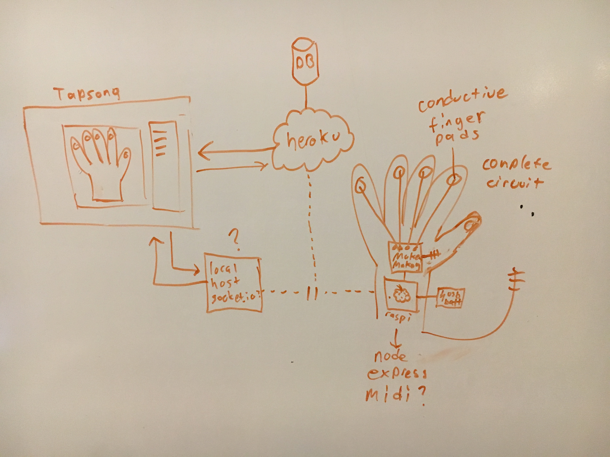

# Tap-a-tune

User Story:

If you ever find yourself tapping your fingers to an imaginary beat? This is the chance to turn that music into reality. Using a  glove with conductive fingertips, tap on any conductive surface (such as a metal table, your arm, even a houseplant) and using a makey-makey as an interface, record that beat using a portable Rasberry Pi running an express server. Automatically upload your musical creation to the cloud,  and save it on your personal Tap-a-Tune web page. Alter the sounds produced using a musical interface drawn from the MIDI api [and potentially share with friends or download a compatible MIDI file - if I have time]. 

Techologies used:
* makey-makey interface: https://learn.sparkfun.com/tutorials/makey-makey-quickstart-guide
* Rasberry Pi running Debian https://www.raspberrypi.org/products/raspberry-pi-2-model-b/
* node.js
* express
* midi-writer js or similar https://www.npmjs.com/package/midi-writer-js
* Web Audio API and/or MIDI API
* Javascript
* React
* CSS
* Postgres
* bcrypt
* jwt

