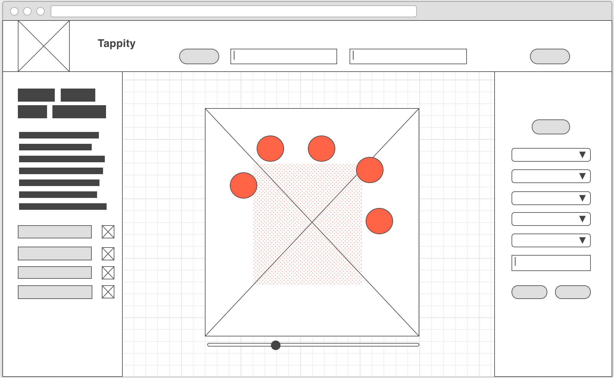

# Tappity

User Story:

Do you ever find yourself tapping your fingers to an imaginary beat? Turn that music into reality! Using a glove with conductive fingertips, tap on any conductive surface (such as a metal table, your arm, even a houseplant) and using a makey-makey as an interface, record the beat and upload your musical creation to the cloud on the Tappity app. Alter the sounds produced utilizing the Web Audio API.

Technologies used:
* makey-makey interface: https://learn.sparkfun.com/tutorials/makey-makey-quickstart-guide
* javascript
* node
* express
* web audio api
* react
* CSS
* postgres
* bcrypt
* json web token

Requirements:
- makey-makey, arduino or similar interface that can produce key presses on user input - in particular a, w, d, f, g is ideal for the full experience. 

Acnowledgements:
@gittheking and @jasonseminara for webpack config
@rapala61 for auth reference
http://www.codrops.com for piano audio samples
http://www.99sounds.org for drum audio samples
Fingerprint images by Ema Dimitrova from the Noun Project
flaticon.com for icon logo
method for converting object into array https://stackoverflow.com/questions/6857468/converting-a-js-object-to-an-array

Known Issues:
- problems with CSS rendering in React
- UX issues
- not mobile friendly
- merge feature occasionally has binding issues

Future Additions:
- cleaner CSS and improved UX
- integration of a raspberry pi server for remote usage
- improved glove design, bypassing need for makey-makey
